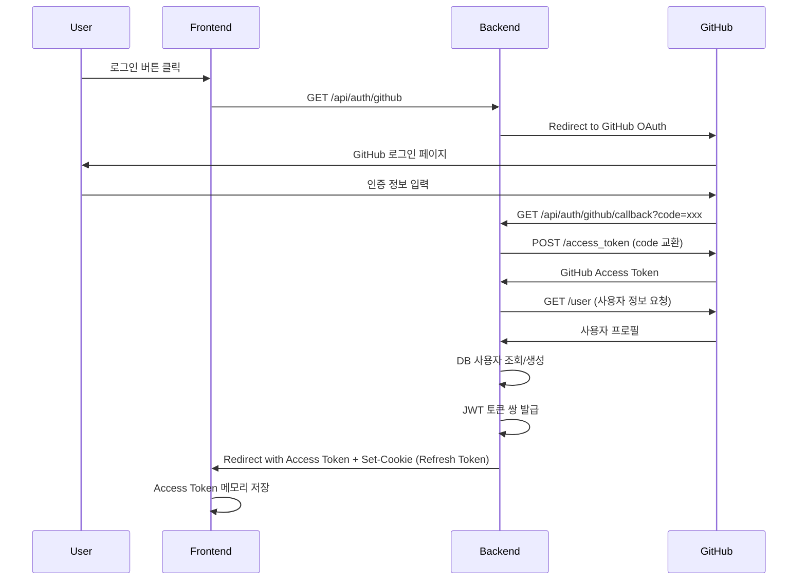
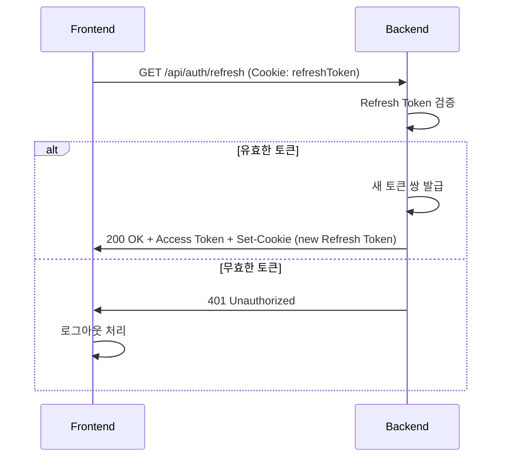
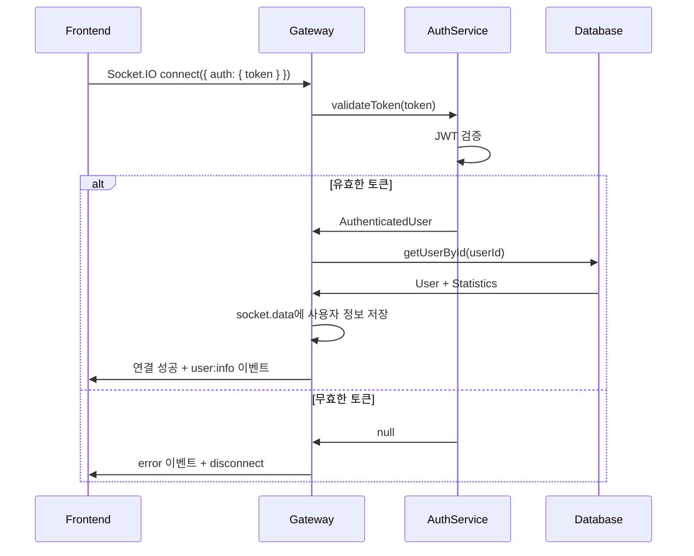
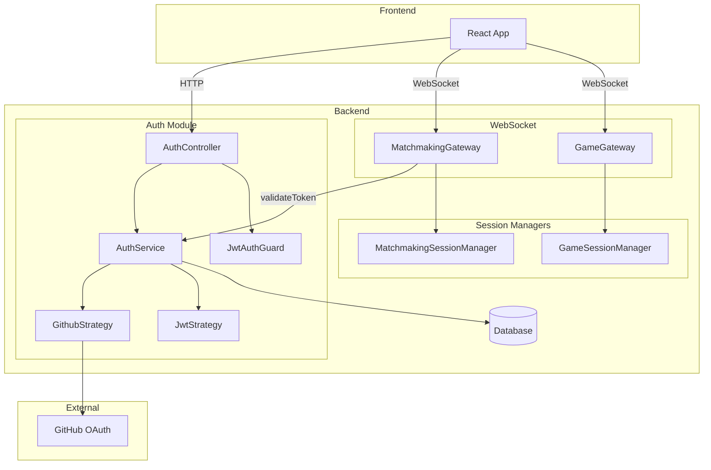
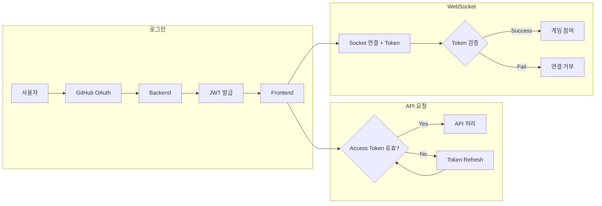

# GitHub OAuth 인증 구현 문서

## 1. JWT vs Session 비교

### 1.1 현재 서비스 특성

| 특성 | 설명 |
|------|------|
| **실시간 통신** | Socket.IO 기반 WebSocket으로 실시간 게임 진행 |
| **서버 구조** | 단일 서버 (추후 확장 가능성 있음) |
| **인프라** | Redis 미사용 |
| **인증 범위** | HTTP API + WebSocket 양쪽 모두 인증 필요 |

### 1.2 비교 분석

| 항목 | JWT | Session Cookie |
|------|-----|----------------|
| **WebSocket 연동** | 간편 (`auth.token`으로 전달) | 복잡 (쿠키 전달 CORS 이슈) |
| **서버 확장성** | Stateless, 수평 확장 용이 | Redis 필요 (다중 서버) |
| **현재 인프라 적합성** | Redis 불필요 | 인메모리만 가능 |
| **토큰 무효화** | 만료 대기 또는 블랙리스트 필요 | 서버에서 즉시 삭제 가능 |
| **보안 (XSS)** | 취약 (메모리 저장 시 완화) | 덜 취약 (HttpOnly 쿠키) |
| **보안 (CSRF)** | 면역 (쿠키 미사용) | 취약 (SameSite로 완화) |
| **페이로드 크기** | 큼 (자체 정보 포함) | 작음 (세션 ID만) |

### 1.3 JWT 선택 근거

#### WebSocket 연동의 용이성
```javascript
// 클라이언트 연결 코드
const socket = io('/ws', {
  auth: {
    token: accessToken  // 간단하게 토큰 전달
  }
});
```

Session 방식의 경우 WebSocket 연결 시 쿠키 전달이 복잡하고, CORS 설정 문제가 발생할 수 있음.

#### Stateless 특성
- 현재 단일 서버이지만, 추후 서버 확장 시 JWT는 추가 인프라(Redis) 없이 확장 가능
- 각 요청마다 토큰 자체에서 사용자 정보 추출

#### 기존 게임 세션과의 분리
- `GameSessionManager`, `MatchmakingSessionManager`는 게임 상태 관리용
- 인증 세션과 독립적으로 운영되어 관심사 분리 명확

### 1.4 JWT 방식의 단점 및 완화 전략

| 단점 | 완화 전략 |
|------|----------|
| 토큰 탈취 시 만료까지 유효 | Access Token 15분, Refresh Token 7일로 짧게 설정 |
| XSS 취약 | Access Token은 메모리 저장 (localStorage 사용 안 함) |
| 토큰 크기 | 필수 정보만 페이로드에 포함 |

---

## 2. OAuth 인증 흐름

### 2.1 전체 시퀀스 다이어그램



### 2.2 토큰 갱신 흐름



### 2.3 WebSocket 인증 흐름



---

## 3. 시스템 아키텍처

### 3.1 인증 모듈 구조

```
packages/backend/src/auth/
├── auth.module.ts          # 모듈 정의
├── auth.controller.ts      # HTTP 엔드포인트
├── auth.service.ts         # 비즈니스 로직
├── strategies/
│   ├── github.strategy.ts  # GitHub OAuth 전략
│   └── jwt.strategy.ts     # JWT 검증 전략
├── guards/
│   └── jwt-auth.guard.ts   # HTTP 요청 보호
└── decorators/
    └── current-user.decorator.ts  # 현재 사용자 추출
```

### 3.2 컴포넌트 다이어그램



---

## 4. API 엔드포인트

### 4.1 인증 API

| Method | Endpoint | 설명 | 인증 필요 |
|--------|----------|------|----------|
| GET | `/api/auth/github` | GitHub OAuth 시작 | X |
| GET | `/api/auth/github/callback` | OAuth 콜백 처리 | X |
| GET | `/api/auth/refresh` | 토큰 갱신 | Refresh Token (Cookie) |
| GET | `/api/auth/logout` | 로그아웃 | X |
| GET | `/api/auth/me` | 현재 사용자 정보 | Access Token |

### 4.2 WebSocket 이벤트

| 이벤트 | 방향 | 설명 |
|--------|------|------|
| `connect` | Client → Server | 연결 시 `auth.token` 필수 |
| `user:info` | Server → Client | 연결 성공 시 사용자 정보 전송 |
| `error` | Server → Client | 인증 실패 시 에러 메시지 |

---

## 5. 토큰 구조

### 5.1 JWT Payload

```typescript
interface JwtPayload {
  sub: number;           // 사용자 DB ID
  visibleId: string;     // 표시용 ID
  nickname: string;      // 닉네임
  oauthProvider: 'github';
  iat: number;           // 발급 시간
  exp: number;           // 만료 시간
}
```

### 5.2 토큰 설정

| 토큰 | 만료 시간 | 저장 위치 | 용도 |
|------|----------|----------|------|
| Access Token | 15분 | 프론트엔드 메모리 | API/WebSocket 인증 |
| Refresh Token | 7일 | HttpOnly Cookie | Access Token 갱신 |

---

## 6. 보안 고려사항

### 6.1 구현된 보안 조치

1. **Refresh Token HttpOnly Cookie**: XSS로 탈취 불가
2. **Access Token 짧은 만료**: 탈취 시 피해 최소화
3. **SameSite=Lax**: CSRF 공격 방지
4. **Secure Cookie (Production)**: HTTPS에서만 전송

### 6.2 프론트엔드 권장사항

```javascript
// Access Token은 메모리에만 저장
let accessToken = null;

// localStorage/sessionStorage 사용 금지
// localStorage.setItem('token', token); // XXX 금지

// 토큰 갱신 로직
async function refreshAccessToken() {
  const response = await fetch('/api/auth/refresh', {
    credentials: 'include'  // Cookie 전송
  });
  const { accessToken: newToken } = await response.json();
  accessToken = newToken;
}
```

---

## 7. 환경 변수

```env
# GitHub OAuth
GITHUB_CLIENT_ID=your_client_id
GITHUB_CLIENT_SECRET=your_client_secret
GITHUB_CALLBACK_URL=http://localhost:4000/api/auth/github/callback

# JWT
JWT_SECRET=your_jwt_secret_key_min_32_chars
JWT_REFRESH_SECRET=your_refresh_secret_key_min_32_chars

# Frontend
FRONTEND_URL=http://localhost:3000
```

---

## 8. 데이터 흐름 요약



---

## 9. 검증 완료 항목

- [x] GitHub OAuth 로그인 플로우
- [x] JWT Access/Refresh Token 발급
- [x] HTTP API 인증 (JwtAuthGuard)
- [x] WebSocket 연결 인증
- [x] 토큰 갱신 엔드포인트
- [x] 로그아웃 처리
- [x] 임시 ID 생성 코드 제거
- [x] 프론트엔드에서 ID 수신하는 코드 제거
